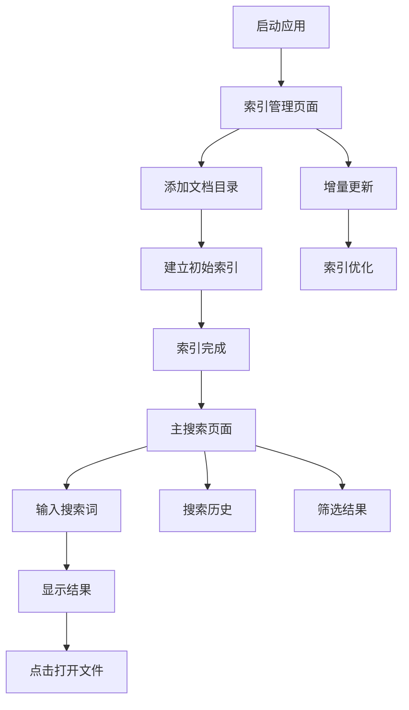

## 1. 产品概述

一款轻量级的跨平台桌面全文检索工具，基于 Tauri + React + Tantivy 技术栈构建。支持本地文档索引、快速全文搜索、离线运行和增量更新，为用户提供高效的本地文档检索体验。

目标用户：需要频繁搜索本地文档的知识工作者、学生、研究人员等，解决传统文件系统搜索效率低、不支持全文内容搜索的问题。

## 2. 核心功能

### 2.1 用户角色

| 角色   | 注册方式      | 核心权限           |
| ---- | --------- | -------------- |
| 普通用户 | 无需注册，本地使用 | 创建索引、执行搜索、管理文档 |

### 2.2 功能模块

全文检索工具包含以下核心页面：

1. **主搜索页面**：搜索框、搜索结果展示、搜索历史、筛选选项。
2. **索引管理页面**：文档目录管理、索引状态、增量更新、索引优化。
3. **设置页面**：搜索配置、索引设置、界面偏好、关于信息。

### 2.3 页面详情

| 页面名称   | 模块名称   | 功能描述                       |
| ------ | ------ | -------------------------- |
| 主搜索页面  | 搜索输入框  | 输入搜索关键词，支持多关键词组合搜索         |
| 主搜索页面  | 搜索结果展示 | 显示匹配的文档列表，包含标题、摘要、匹配度、文件路径 |
| 主搜索页面  | 搜索历史   | 记录最近搜索关键词，支持快速重搜           |
| 主搜索页面  | 筛选选项   | 按文件类型、修改时间、文件大小等条件筛选       |
| 索引管理页面 | 文档目录管理 | 添加、删除、编辑需要索引的文件夹路径         |
| 索引管理页面 | 索引状态监控 | 显示索引进度、文档数量、索引大小           |
| 索引管理页面 | 增量更新   | 检测文件变化，自动更新索引              |
| 索引管理页面 | 索引优化   | 重建索引、压缩索引、清理无效索引           |
| 设置页面   | 搜索配置   | 设置搜索结果数量、匹配精度、高亮显示         |
| 设置页面   | 索引设置   | 配置索引更新频率、排除文件类型、最大文件大小     |
| 设置页面   | 界面偏好   | 主题切换、语言选择、快捷键设置            |
| 设置页面   | 关于信息   | 版本信息、开源协议、更新检查             |

## 3. 核心流程

**用户使用流程**：

1. 首次启动应用，添加需要索引的文档目录
2. 系统开始建立初始索引，显示进度
3. 索引完成后，用户在搜索框输入关键词
4. 系统实时显示搜索结果，支持点击打开源文件
5. 用户可以管理索引目录，系统会自动增量更新

## 4. 用户界面设计

### 4.1 设计风格

* **主色调**：深蓝色 (#2563eb) 搭配浅灰色 (#f8fafc)

* **按钮样式**：圆角矩形，悬停效果，主要操作为实心按钮

* **字体**：系统默认字体，标题 16px，正文 14px，小字 12px

* **布局风格**：左侧边栏导航 + 右侧主内容区域，卡片式搜索结果

* **图标风格**：使用简洁的线性图标，支持深色/浅色主题切换

### 4.2 页面设计概述

| 页面名称   | 模块名称  | UI 元素                   |
| ------ | ----- | ----------------------- |
| 主搜索页面  | 搜索输入框 | 顶部居中，大字体输入框，支持搜索建议      |
| 主搜索页面  | 搜索结果  | 卡片式布局，显示文档图标、标题、摘要、匹配度条 |
| 主搜索页面  | 侧边筛选  | 左侧抽屉式，包含文件类型、时间范围等筛选器   |
| 索引管理页面 | 目录列表  | 表格形式显示已添加目录，包含路径、文件数、状态 |
| 索引管理页面 | 操作按钮  | 添加目录、重建索引、暂停更新等操作按钮     |
| 设置页面   | 配置分组  | 分组显示不同设置项，使用开关、下拉框等控件   |

### 4.3 响应式设计

* **桌面优先**：主要针对桌面端优化，支持 Windows、macOS、Linux

* **窗口大小**：最小窗口 800x600，支持最大化、调整大小

* **触控优化**：支持基本的触控操作，但主要面向键鼠交互

