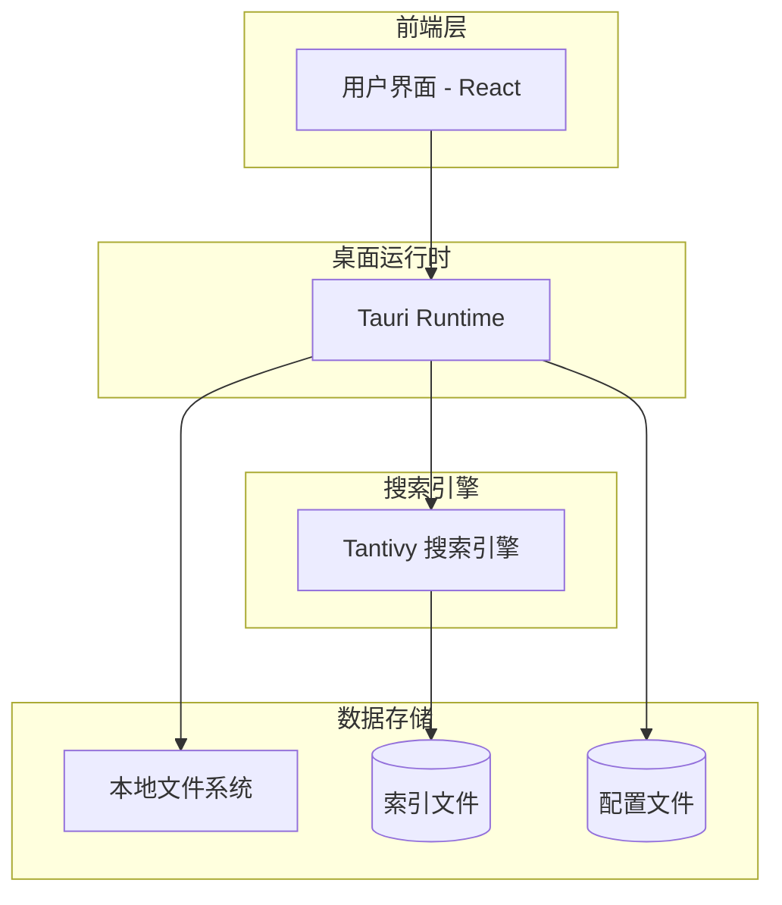
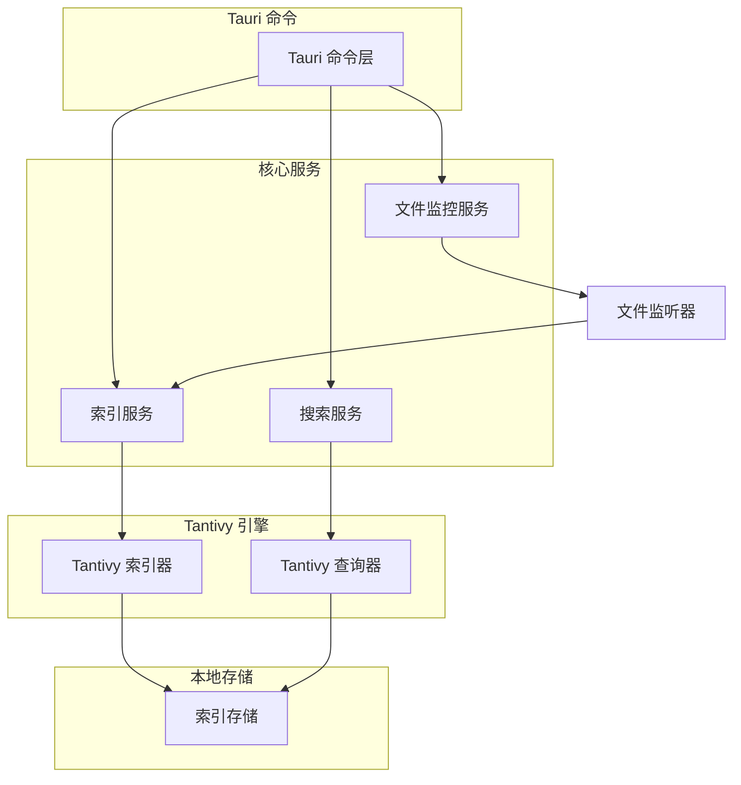
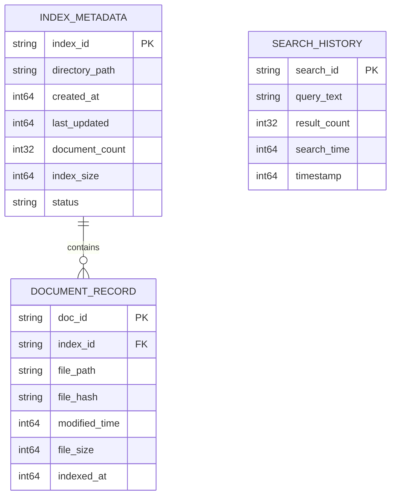

## 1. 架构设计



## 2. 技术描述

* **前端框架**: React\@18 + TypeScript + Tailwind CSS

* **桌面框架**: Tauri\@1.0 (Rust 后端 + Web 前端)

* **搜索引擎**: Tantivy (Rust 全文搜索引擎)

* **构建工具**: Vite

* **状态管理**: React Context + useReducer

* **文件监听**: notify (Rust crate)

* **初始化工具**: create-tauri-app

## 3. 路由定义

| 路由                | 用途                 |
| ----------------- | ------------------ |
| /                 | 主搜索页面，全文搜索核心功能     |
| /index-management | 索引管理页面，管理文档目录和索引状态 |
| /settings         | 设置页面，应用配置和偏好设置     |

## 4. 核心数据结构

### 4.1 文档索引结构

```rust
// Tantivy 文档结构
struct Document {
    id: String,
    title: String,
    content: String,
    file_path: String,
    file_type: String,
    modified_time: i64,
    file_size: u64,
}
```

### 4.2 搜索结果结构

```typescript
interface SearchResult {
  id: string;
  title: string;
  content: string;
  filePath: string;
  fileType: string;
  modifiedTime: number;
  score: number;
  highlights: string[];
}

interface SearchResponse {
  results: SearchResult[];
  totalCount: number;
  searchTime: number;
  hasMore: boolean;
}
```

### 4.3 索引配置结构

```typescript
interface IndexConfig {
  directories: DirectoryConfig[];
  updateInterval: number; // 秒
  excludePatterns: string[];
  maxFileSize: number; // 字节
  supportedFileTypes: string[];
}

interface DirectoryConfig {
  path: string;
  enabled: boolean;
  recursive: boolean;
  lastIndexed: number;
}
```

## 5. 后端架构设计



## 6. 数据模型

### 6.1 索引元数据模型



### 6.2 本地存储结构

```
~/.config/fulltext-search/
├── indexes/
│   ├── default/
│   │   ├── meta.json
│   │   ├── segments/
│   │   └── temp/
│   └── custom/
├── config/
│   ├── app.json
│   ├── directories.json
│   └── settings.json
└── logs/
    ├── error.log
    └── search.log
```

## 7. 核心功能实现

### 7.1 索引构建流程

1. **文件扫描**: 递归扫描配置的目录，收集文件元数据
2. **内容提取**: 根据文件类型提取文本内容（支持 TXT、MD、PDF、DOCX 等）
3. **索引创建**: 使用 Tantivy 创建倒排索引，支持分词和词干提取
4. **增量更新**: 基于文件修改时间和哈希值检测变更

### 7.2 搜索执行流程

1. **查询解析**: 解析用户输入，支持布尔查询和短语查询
2. **索引搜索**: 在 Tantivy 索引中执行搜索，获取匹配文档
3. **结果排序**: 基于相关性评分和文件属性进行排序
4. **高亮显示**: 提取匹配片段，生成搜索结果摘要

### 7.3 文件监控机制

* 使用 notify crate 监听文件系统事件

* 维护文件变更队列，避免频繁重建索引

* 支持定时批量更新和实时增量更新两种模式

