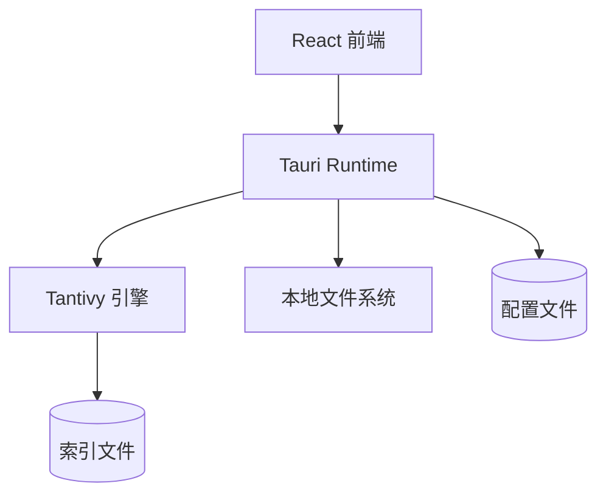

# Lunary — 轻量级跨平台桌面全文检索工具

Lunary 是一款基于 Tauri + React + Tantivy 的跨平台桌面全文检索应用，专注于本地文档的高效索引与快速搜索。支持离线运行、增量更新、筛选与搜索历史，面向知识工作者、学生与研究人员的日常文件检索场景。

## 特性

- 本地全文检索：基于 Tantivy 倒排索引与相关性排序
- 离线可用：所有数据在本地处理与存储
- 增量更新：监听文件变化，自动更新索引
- 多维筛选：文件类型、修改时间、大小等过滤条件
- 搜索高亮：结果摘要与命中高亮
- 搜索历史：快捷回溯与复用查询
- 跨平台：Windows / macOS / Linux（Tauri）

## 技术栈

- 前端：React 18、TypeScript、Vite、Tailwind CSS
- 桌面运行时：Tauri v2
- 搜索引擎：Tantivy（Rust）
- 文件监听：notify（Rust）

## 架构



页面与路由：
- `/` 主搜索页面
- `/index-management` 索引管理页面
- `/settings` 设置页面

## 目录结构

```
src/
├── components/
│   ├── SearchFilters.tsx
│   ├── SearchHistory.tsx
│   ├── SearchResults.tsx
│   └── Sidebar.tsx
├── pages/
│   ├── IndexManagementPage.tsx
│   ├── SearchPage.tsx
│   └── SettingsPage.tsx
├── types/
│   └── index.ts
├── App.css
├── App.tsx
├── index.css
├── main.tsx
└── vite-env.d.ts

src-tauri/
├── src/
│   ├── lib.rs   # Tauri 命令与插件加载（当前含 greet 示例）
│   └── main.rs  # 入口，调用 lunary_lib::run()
├── Cargo.toml
└── tauri.conf.json
```

## 快速开始

### 环境准备

- 安装 Node.js 18+ 与 npm / pnpm / yarn
- 安装 Rust（`rustup`）与 Tauri 必要依赖（各平台见 https://tauri.app/）

### 安装依赖

```
npm install
```

### 前端开发（仅 Web UI）

```
npm run dev
```

访问 `http://localhost:1420/`（端口以 Vite 输出为准）。

### 桌面应用开发（Tauri）

```
npm run tauri dev
```

启动 Rust 后端与前端开发服务器，启用桌面窗口与 Tauri 能力。

### 生产构建

```
npm run build        # 构建前端静态资源
npm run tauri build  # 打包桌面应用安装包
```

## 使用说明

- 首次启动：在“索引管理”页面添加需要索引的目录，等待初始索引完成
- 搜索：在主搜索页面输入关键字，查看结果摘要与高亮，支持点击打开源文件
- 筛选：使用左侧筛选器按类型、时间、大小过滤结果
- 增量更新：文件变更将自动纳入索引（可在设置中调整策略）

## 配置与数据

- 索引与配置文件存储于系统应用数据目录（实际路径由 Tauri 决定）
- 预计结构示例：

```
~/.config/lunary/
├── indexes/
│   └── default/          # Tantivy 索引目录
├── config/
│   ├── app.json
│   ├── directories.json  # 索引目录配置
│   └── settings.json     # 应用设置
└── logs/
    └── search.log
```

## 进度与路线图

- 已完成：前端 UI（搜索页、索引管理、设置）、路由与样式；Tauri 基础框架与示例命令
- 进行中：Tantivy 集成、内容抽取（TXT/MD/PDF/DOCX）、增量更新与文件监听、Tauri 命令对接

## 开发提示

- 推荐 IDE：VS Code + Tauri 扩展 + rust-analyzer
- 若遇到 Tauri 编译问题，请先确认平台依赖（Xcode/Visual Studio/GTK 等）已安装

## 许可证

MIT

## 致谢

- Tauri 团队与生态
- Tantivy 搜索引擎
- React 社区
